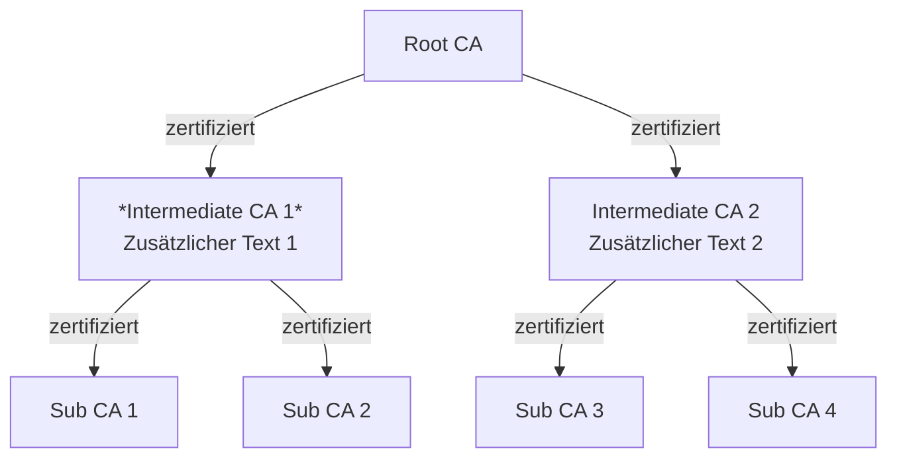

#PKI-Diagramm

Dies ist ein einfaches Flussdiagramm, das in Mermaid erstellt wurde:

```mermaid
graph TD
  RootCA[Root CA] -->|zertifiziert| CA1[*Intermediate CA 1*<br>Zusätzlicher Text 1]
  RootCA -->|zertifiziert| CA2[Intermediate CA 2<br>Zusätzlicher Text 2]

  CA1 -->|zertifiziert| SubCA1[Sub CA 1]
  CA1 -->|zertifiziert| SubCA2[Sub CA 2]

  CA2 -->|zertifiziert| SubCA3[Sub CA 3]
  CA2 -->|zertifiziert| SubCA4[Sub CA 4]
```